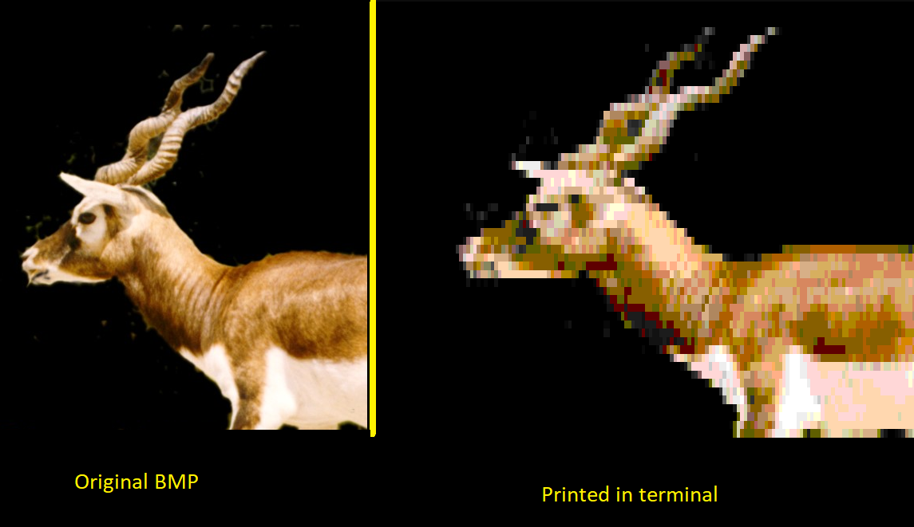

# sharp-render

A terminal-based BMP image viewer that renders bitmap images directly in your console using ANSI 256-color codes.

## Overview

sharp-render is a C# application that parses BMP files and displays them in the terminal by converting pixels to colored block characters. It automatically scales images to fit your terminal window while preserving as much detail as possible through bilinear interpolation.

## Example



## Features

- **BMP File Parsing**: Reads uncompressed 24-bit BMP files
- **Automatic Scaling**: Resizes images to fit your terminal dimensions using bilinear interpolation
- **Color Mapping**: Intelligently maps millions of colors to the 256-color ANSI palette
- **Cross-Platform**: Works on any terminal that supports ANSI escape codes

## Requirements

- .NET 9.0 or later
- A terminal that supports ANSI 256-color escape codes (most modern terminals)

## Installation

1. Clone the repository:
```bash
git clone https://github.com/Username0103/sharp-render.git
cd sharp-render
```

2. Build the project:
```bash
dotnet build
```

## Usage

For best results, size your terminal to be close to the aspect ratio of the target image.  

```bash
dotnet run -h
dotnet run "path/to/your/image.bmp"
dotnet run -p "path/to/your/image.bmp"
dotnet run --path "path/to/your/image.bmp"
```

## Technical Details

### Architecture

The project is organized into three main components:

- **IMGParse**: Handles BMP file parsing and data extraction
  - Reads BMP headers and validates format
  - Extracts pixel data and converts to Color objects
  - Handles little-endian byte ordering

- **IMGHandle**: Processes images for terminal display
  - Resizes images using bilinear interpolation
  - Maps RGB colors to nearest ANSI 256-color codes

- **Common**: Shared utilities and rendering
  - Color data structure
  - ANSI color definitions
  - Terminal printing logic

### Supported Formats

Currently supports:
- Uncompressed BMP files
- 24-bit color depth (true color)
- See [this](https://online-converting.com/image/convert2bmp/) for conversions.

### Color Mapping

The application maps RGB colors to the ANSI 256-color palette:
- Colors 0-15: Standard and high-intensity colors
- Colors 16-231: 6×6×6 RGB color cube
- Colors 232-255: Grayscale gradient

Color matching uses Manhattan distance to find the nearest available color.

## Limitations

- Only supports uncompressed BMP format
- Requires 24-bit color depth
- Image quality depends on terminal size and font

## Future Enhancements

- Support for additional image formats (PNG, JPEG)
- Different scaling algorithms
- Custom color mapping strategies
- ASCII art mode for non-color terminals

## License

MIT Liscense

## Contributing

Contributions are welcome! Please feel free to submit a Pull Request.
