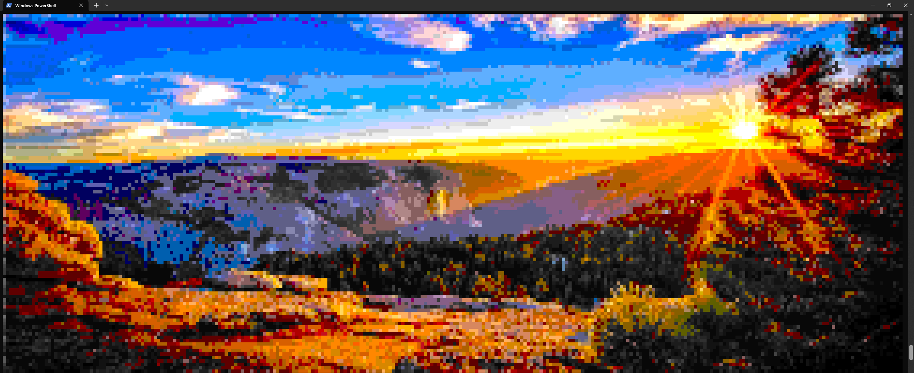

# Sharp-Render

A terminal-based BMP image viewer that renders bitmap images directly in your console using ANSI 256-color codes.

## Overview

Sharp-Render is a C# application that parses BMP files and displays them in the terminal by converting pixels to colored block characters. It automatically scales images to fit your terminal window while preserving as much detail as possible through bilinear interpolation.

## Example



## Features

- **BMP File Parsing**: Reads uncompressed 24-bit BMP files (Most BMPs are.)
- **Automatic Scaling**: Resizes images to fit your terminal dimensions using bilinear interpolation
- **Color Mapping**: Maps colors to the 256-color 8-bit ANSI palette
- **Cross-Platform**: Works on any terminal that supports ANSI escape codes

## Requirements

- .NET 9.0 or later
- A terminal that supports ANSI 256-color escape codes (Most modern terminals, but not Windows CMD)

## Installation
  
Precombiled binaries are avaliable on the releases.
  
To run from source:
```bash
git clone https://github.com/Username0103/sharp-render
cd sharp-render
dotnet run
```

## Usage

For best results, size your terminal to be close to the aspect ratio of the target image.  
Decreasing the font size increases the avaliable resolution, but it does get slower.
Since Floyd–Steinberg dithering depends on the previous results, dithering runs on a single core and thus is very slow.
  
## Future Enhancements

- Support for additional image formats (PNG, JPEG)
- Different scaling algorithms
- ASCII art mode for non-color terminals

## License

MIT Liscense

## Contributing

Contributions are welcome! Please feel free to submit a Pull Request.

## More examples

### With dithering


### High-Res


### High-Res with Dither
